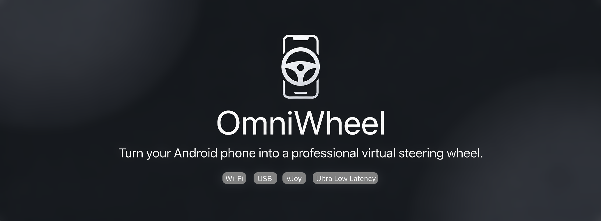

<div align="center">

<a href="https://github.com/topeck0/OmniWheel/releases">

</a>

# 🛞 OmniWheel

### Turn your Android phone into a professional Virtual Steering Wheel.

**Low Latency • Wi-Fi • USB • vJoy • Touch Steering • Gyroscope**

<p>

<a href="https://github.com/topeck0/OmniWheel/releases">

</a>

<a href="https://github.com/topeck0/OmniWheel/releases">

</a>


</p>

---

## 🚀 Quick Access

| |
|:-:|
| <a href="#about">About</a> • <a href="#features">Features</a> • <a href="#screenshots">Screenshots</a> • <a href="#performance">Performance</a> • <a href="#architecture">Architecture</a> • <a href="#games">Games</a> • <a href="#installation">Installation</a> • <a href="#roadmap">Roadmap</a> |

</div>

---

<h2 id="about">✨ About</h2>

OmniWheel transforms your Android phone into a professional virtual steering wheel for Windows.

Designed for driving simulators with:

- Ultra-low latency
- Touch steering
- Gyroscope
- USB
- Wi-Fi
- Modern UI
- Custom Profiles
- vJoy Integration

---

<h2 id="features">🎯 Features</h2>

| Steering | Connectivity |
|----------|-------------|
| Touch Steering | Wi-Fi |
| Steering Physics | USB |
| Deadzone | Auto Discovery |
| Curves | Fast Reconnect |

| Controls | Sensors |
|----------|---------|
| Pedals | Gyroscope |
| Handbrake | Accelerometer |
| Unlimited Buttons | Drift Correction |
| Custom Layouts | Calibration |

---

<h2 id="screenshots">📷 Screenshots</h2>

> Coming Soon

---

<h2 id="performance">⚡ Performance</h2>

| Feature | Status |
|---------|:------:|
| Ultra Low Latency | ✅ |
| UDP | ✅ |
| Gyroscope | ✅ |
| Touch Steering | ✅ |
| Profiles | ✅ |

---

<h2 id="architecture">🧠 Architecture</h2>

```text
Android Phone
      │
Touch / Gyroscope
      │
      ▼
OmniWheel Android
      │
 UDP / TCP / USB
      │
      ▼
OmniWheel Windows
      │
      ▼
    vJoy Driver
      │
      ▼
      Game
```

---

<h2 id="games">🎮 Supported Games</h2>

- Euro Truck Simulator 2
- BeamNG.drive
- American Truck Simulator
- Assetto Corsa
- Assetto Corsa Competizione
- Live For Speed
- rFactor 2
- Any game supporting vJoy

---

<h2 id="installation">📦 Installation</h2>

<details>

<summary><b>📱 Android</b></summary>

Download & install the latest APK from Releases.

</details>

<details>

<summary><b>🖥 Windows</b></summary>

Please make sure that [.NET 8 Framework](https://dotnet.microsoft.com/en-us/download/dotnet/thank-you/sdk-8.0.423-windows-x64-installer) is installed.

Install [vJoy](https://sourceforge.net/projects/vjoystick/files/latest/download) from the official page on [SourceForge](https://sourceforge.net/projects/vjoystick/files/latest/download).

Importand Note: Run Configure vJoy and set Numbers of Buttons to whatever number you want >=30 

Download the Windows Receiver from releases and run it.

</details>

---

<h2 id="roadmap">🛠 Roadmap</h2>

- [x] Planning
- [x] Architecture
- [x] Android App
- [ ] Windows Receiver
- [ ] USB Mode
- [ ] Profiles
- [ ] Themes
- [ ] Plugins

---

## ❤️ Contributing

Issues, feature requests and Pull Requests are welcome.

---

<div align="center">

## ⭐ Support

If you enjoy OmniWheel, consider giving the repository a ⭐.

<a href="https://github.com/topeck0/OmniWheel/releases">


</a>

<br><br>

Made with ❤️ for the Sim Racing Community.

</div>
